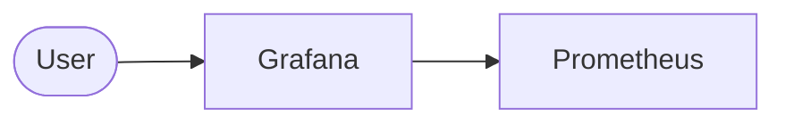

تونستم انسیبل بزنم و این خروجی هارو گرفتم . 

TASK [monitoring : Add Grafana repository] ***********************************************************************************
ok: [mon-1]

TASK [monitoring : Update apt cache after adding Grafana repository] *********************************************************
changed: [mon-1]

TASK [monitoring : Install monitoring packages] ******************************************************************************
ok: [mon-1]

TASK [monitoring : Start and enable services] ********************************************************************************
ok: [mon-1] => (item=prometheus)
ok: [mon-1] => (item=grafana-server)
ok: [mon-1] => (item=prometheus-node-exporter)

TASK [monitoring : Create Grafana datasource provisioning config] ************************************************************
ok: [mon-1]

TASK [monitoring : Create Dashboard provisioning config] *********************************************************************
ok: [mon-1]

TASK [monitoring : Create Grafana dashboards directory] **********************************************************************
changed: [mon-1]

TASK [monitoring : Copy dashboard JSON] **************************************************************************************
changed: [mon-1]

TASK [monitoring : Restart Grafana] ******************************************************************************************
changed: [mon-1]

PLAY RECAP *******************************************************************************************************************
mon-1                      : ok=14   changed=4    unreachable=0    failed=0    skipped=0    rescued=0    ignored=0


ولی تو خود سرور چیزی ندیدم.وقت هم نشد بهمم مشکل چیه .
# Scenario 2

Draw the **output** system. You can use AI.
Then explain your code. 

English is better. Persian is OK.

## Architecture

Replace this picture with your real design.



## Code

### Playbook & Roles

Explain the playbook or roles you have created. 
For example: 
+ `package`: Install requirements

### Inventory
Explain your Inventory if needed

## Credentials / Login
Add any login or credential data here. For example
```
# Grafana
user: admin
pass: admin
```

# Challenges

Write one item for each challenge. What broke, and how you fixed it.
For example: 

+ **Internet Connection**: Iran block downloading from dockerhub 
+ **Access to VM** is not available through my network
